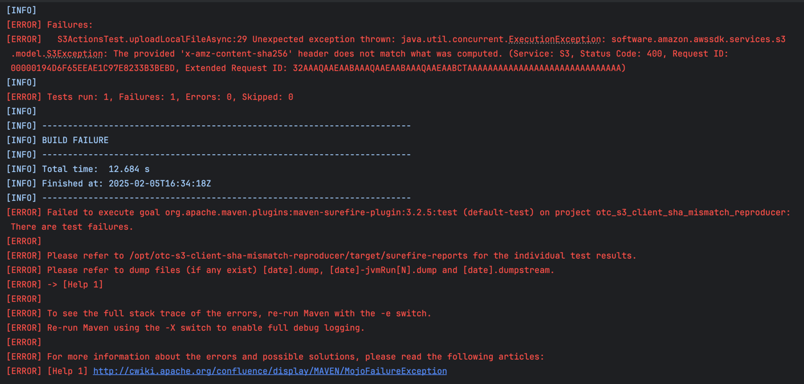
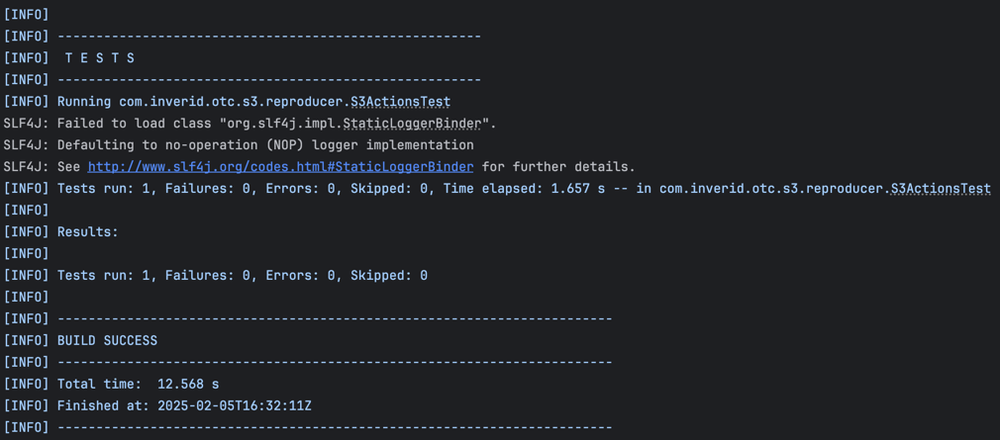

# otc-s3-client-sha-mismatch-reproducer
OTC S3 client SHA mismatch reproducer

## About

This reproduces the error documented in https://github.com/minio/minio/issues/20875

as a consequence of
https://docs.aws.amazon.com/sdk-for-java/latest/developer-guide/s3-checksums.html


introduced in https://github.com/aws/aws-sdk-java-v2/blob/2.30.0/CHANGELOG.md#features-5

## Requirements

 - An OBS bucket accessible in https://obs.eu-nl.otc.t-systems.com
 - Writing credentials to that bucket
 - Docker with docker compose: https://www.docker.com/


## Usage

```bash
# AWS_SDK_VERSION >= 2.30.0 *** REPRODUCES THE ERROR ***
docker compose up -d \
  -e AWS_SDK_VERSION=2.30.0 \
  -e OBS_BUCKET_NAME=<bucket_name> \
  -e AWS_ACCESS_KEY_ID=<obs_access_key_id> \
  -e AWS_SECRET_ACCESS_KEY=<obs_secret_access_key> && \
  docker compose logs -f

# AWS_SDK_VERSION=2.29.52 *** DOES NOT REPRODUCE THE ERROR ***
docker compose up -d \
  -e AWS_SDK_VERSION=2.29.52 \
  -e OBS_BUCKET_NAME=<bucket_name> \
  -e AWS_ACCESS_KEY_ID=<obs_access_key_id> \
  -e AWS_SECRET_ACCESS_KEY=<obs_secret_access_key> && \
  docker compose logs -f

```

The JUnit test contained in this project will try to write a file via AWS PutObject request to the provided OBS bucket.

> [!WARNING]
> **The bucket must exist and be writable with the provided credentials.**

The test will succeed if the PutObject request succeeds; It will fail if the request fails.

Pay attention to the error response on fail: When the issue is reproduced, it will show the message
```
S3ActionsTest.uploadLocalFileAsync:29 Unexpected exception thrown: java.util.concurrent.ExecutionException:
software.amazon.awssdk.services.s3.model.S3Exception:
The provided 'x-amz-content-sha256' header does not match what was computed.
```

### Failed run with AWS_SDK_VERSION>=2.30.0




### Successful run with AWS_SDK_VERSION=2.29.52

